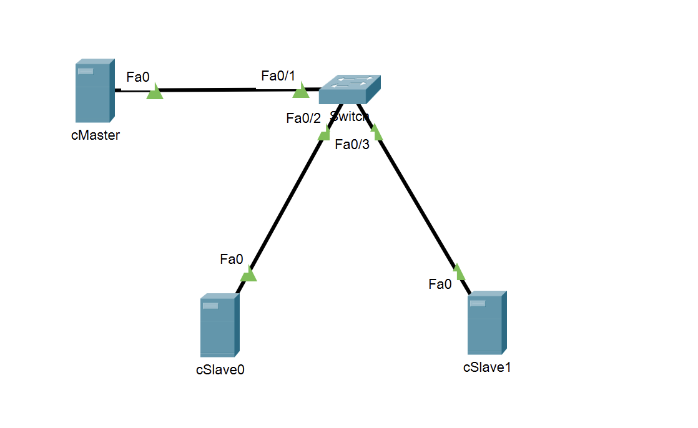
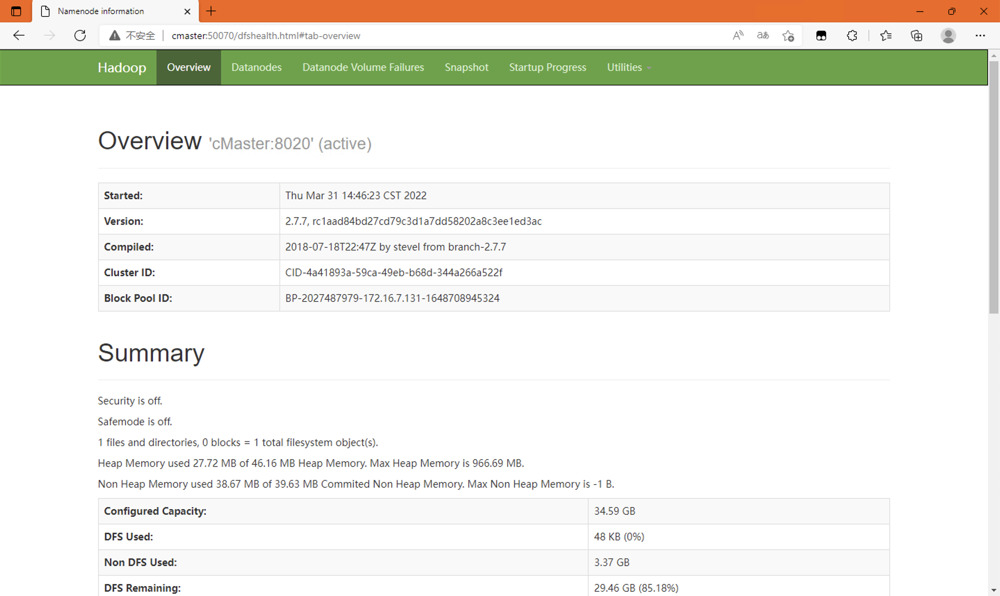
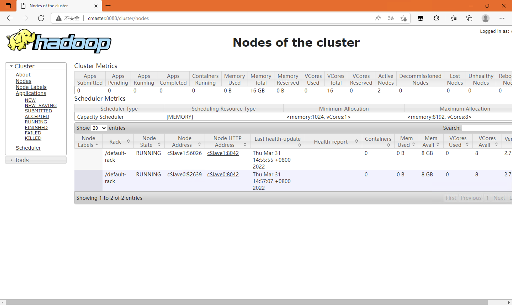
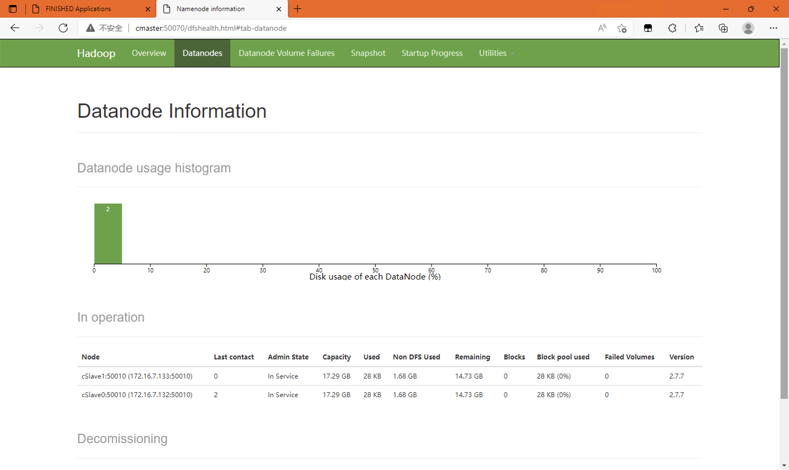
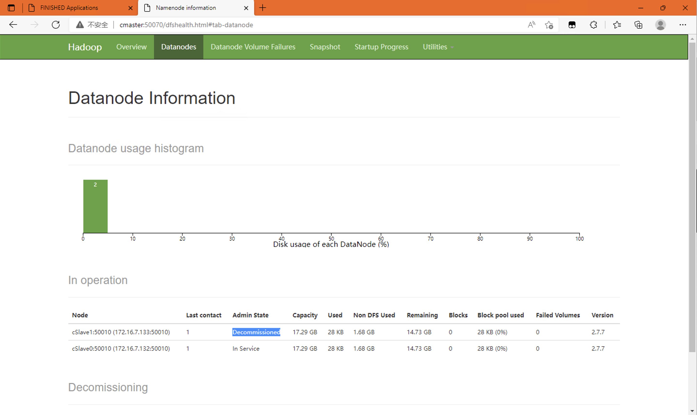
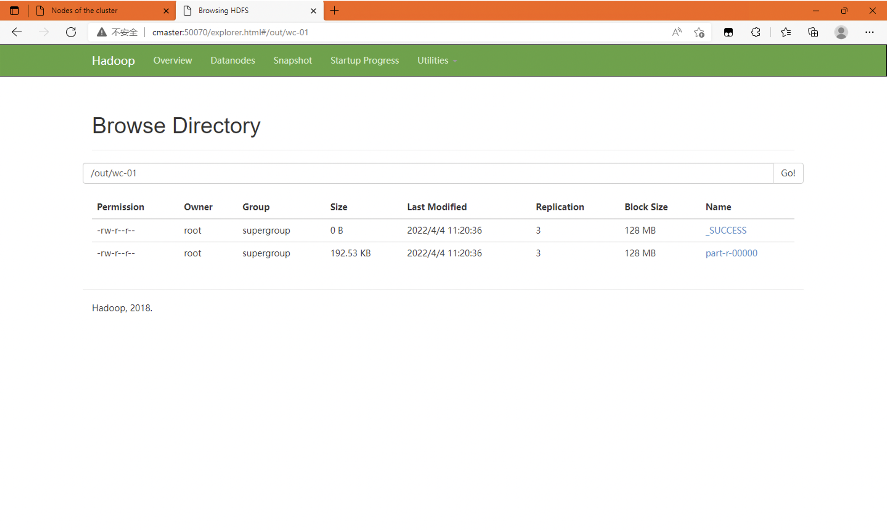

# Ex1

* 分布式系统hadoop部署实验

## 下载软件

* [CentOS](https://mirrors.aliyun.com/centos-vault/6.5/isos/x86_64/CentOS-6.5-x86_64-bin-DVD1.iso)（老师提供 经典6.5）
* [Hadoop](https://archive.apache.org/dist/hadoop/common/hadoop-2.7.7/hadoop-2.7.7.tar.gz)（2.7.7，换其它2.7.x版本也一样）
* [JDK](https://mirrors.tuna.tsinghua.edu.cn/AdoptOpenJDK/8/jdk/x64/linux/OpenJDK8U-jdk_x64_linux_hotspot_8u322b06.tar.gz)（8）

下载完以后先使用**CentOS**镜像安装系统，安装完成以后将**Hadoop以及JDK**放入**root家目录**。

## 安装Hadoop

> 注意：多节点部署，所有节点都要进行操作

### 前期准备

* 关防火墙及安全规则

```
service iptables stop
chkconfig iptables off
setenforce 0
sed -i 's/^SELINUX=.*/SELINUX=disabled/g' /etc/selinux/config
```

### 解压软件

```bash
cd /opt/
tar zxf ~/hadoop-2.7.7.tar.gz
tar zxf ~/OpenJDK8U-jdk_x64_linux_hotspot_8u322b06.tar.gz
```

### 配置环境变量

将以下内容添加到```~/.bash_profile```以及```/etc/profile```的尾部。

```bash
export HADOOP_HOME="/opt/hadoop-2.7.7"
export JAVA_HOME="/opt/jdk8u322-b06"
export PATH="$HADOOP_HOME/bin:$HADOOP_HOME/sbin:$JAVA_HOME/bin:$PATH"
```

添加后执行```source ~/.bash_profile```加载环境变量

## 配置Hadoop

### 主机名映射

* 将以下内容添加到所有节点的```/etc/hosts```。

> 注意：要改成对应的IP

```log
172.16.7.131 cMaster
172.16.7.132 cSlave0
172.16.7.133 cSlave1
```

然后在每一个节点修改```/etc/sysconfig/network```中```HOSTNAME=```对应的主机名，最后重启即可。

### SSH免密登录

由于在**主节点**启动**Hadoop**需要通过**ssh**对**从节点**进行操作，所以为了避免重复输入密码，需要配置免密登录。

* 生成密钥

```log
[root@cMaster ~]# ssh-keygen 
Generating public/private rsa key pair.
Enter file in which to save the key (/root/.ssh/id_rsa): 
Enter passphrase (empty for no passphrase): 
Enter same passphrase again: 
Your identification has been saved in /root/.ssh/id_rsa.
Your public key has been saved in /root/.ssh/id_rsa.pub.
The key fingerprint is:
1c:3d:4f:36:0c:ce:cb:83:58:b9:4f:df:e6:5e:fe:b0 root@cMaster
The key's randomart image is:
+--[ RSA 2048]----+
|          .      |
|         = o     |
|        + = =    |
|       + = * .   |
|      . S = .    |
|         o o .   |
|          . . + .|
|             o = |
|             .E +|
+-----------------+
[root@cMaster ~]# 
```

* 复制密钥

```log
[root@cMaster ~]# ssh-copy-id root@cMaster
The authenticity of host 'cmaster (172.16.7.131)' can't be established.
RSA key fingerprint is 0d:37:9d:be:73:dd:26:d1:1c:88:fd:d9:7d:c5:b3:fc.
Are you sure you want to continue connecting (yes/no)? yes
Warning: Permanently added 'cmaster,172.16.7.131' (RSA) to the list of known hosts.
root@cmaster's password: 
Now try logging into the machine, with "ssh 'root@cMaster'", and check in:

  .ssh/authorized_keys

to make sure we haven't added extra keys that you weren't expecting.

[root@cMaster ~]# ssh-copy-id root@cSlave0
The authenticity of host 'cslave0 (172.16.7.132)' can't be established.
RSA key fingerprint is 0d:37:9d:be:73:dd:26:d1:1c:88:fd:d9:7d:c5:b3:fc.
Are you sure you want to continue connecting (yes/no)? yes
Warning: Permanently added 'cslave0,172.16.7.132' (RSA) to the list of known hosts.
root@cslave0's password: 
Now try logging into the machine, with "ssh 'root@cSlave0'", and check in:

  .ssh/authorized_keys

to make sure we haven't added extra keys that you weren't expecting.

[root@cMaster ~]# ssh-copy-id root@cSlave1
The authenticity of host 'cslave1 (172.16.7.133)' can't be established.
RSA key fingerprint is 0d:37:9d:be:73:dd:26:d1:1c:88:fd:d9:7d:c5:b3:fc.
Are you sure you want to continue connecting (yes/no)? yes
Warning: Permanently added 'cslave1,172.16.7.133' (RSA) to the list of known hosts.
root@cslave1's password: 
Now try logging into the machine, with "ssh 'root@cSlave1'", and check in:

  .ssh/authorized_keys

to make sure we haven't added extra keys that you weren't expecting.

[root@cMaster ~]# 
```


### 配置HDFS

* 在所有节点，修改文件```/opt/hadoop-2.7.7/etc/hadoop/core-site.xml```，在**configuration**标签中添加以下内容。

```xml
<property><name>fs.defaultFS</name><value>hdfs://cMaster:8020</value></property>
```

* 格式化**hdfs**，执行以下内容。

```log
[root@cMaster hadoop]# hdfs namenode -format
22/03/31 14:42:24 INFO namenode.NameNode: STARTUP_MSG:
/************************************************************
STARTUP_MSG: Starting NameNode
STARTUP_MSG:   host = cMaster/172.16.7.131
STARTUP_MSG:   args = [-format]
STARTUP_MSG:   version = 2.7.7
STARTUP_MSG:   classpath ...中间省略一堆内容...
/************************************************************
SHUTDOWN_MSG: Shutting down NameNode at cMaster/172.16.7.131
************************************************************/
```

### 配置资源管理器

* 在所有节点，修改文件```/opt/hadoop-2.7.7/etc/hadoop/yarn-site.xml```，在**configuration**标签中添加以下内容。

```xml
<property><name>yarn.resourcemanager.hostname</name><value>cMaster</value></property>                                                                                  
<property><name>yarn.nodemanager.aux-services</name><value>mapreduce_shuffle</value></property>     
```

### 配置MapReduce

* 在所有节点，创建文件```/opt/hadoop-2.7.7/etc/hadoop/mapred-site.xml```，添加以下内容。

```xml
<?xml version="1.0"?>
<?xml-stylesheet type="text/xsl" href="configuration.xsl"?>
<!--
  Licensed under the Apache License, Version 2.0 (the "License");
  you may not use this file except in compliance with the License.
  You may obtain a copy of the License at

    http://www.apache.org/licenses/LICENSE-2.0

  Unless required by applicable law or agreed to in writing, software
  distributed under the License is distributed on an "AS IS" BASIS,
  WITHOUT WARRANTIES OR CONDITIONS OF ANY KIND, either express or implied.
  See the License for the specific language governing permissions and
  limitations under the License. See accompanying LICENSE file.
-->

<!-- Put site-specific property overrides in this file. -->

<configuration>
<property><name>mapreduce.framework.name</name><value>yarn</value></property>
</configuration>
```


## 启动Hadoop

```log
[root@cMaster hadoop]# hadoop-daemon.sh start namenode
starting namenode, logging to /opt/hadoop-2.7.7/logs/hadoop-root-namenode-cMaster.out
[root@cMaster hadoop]# yarn-daemon.sh start resourcemanager
starting resourcemanager, logging to /opt/hadoop-2.7.7/logs/yarn-root-resourcemanager-cMaster.out
[root@cMaster hadoop]# 
```

```log
[root@cSlave0 ~]# hadoop-daemon.sh start datanode
starting datanode, logging to /opt/hadoop-2.7.7/logs/hadoop-root-datanode-cSlave0.out
[root@cSlave0 ~]# yarn-daemon.sh start nodemanager
starting nodemanager, logging to /opt/hadoop-2.7.7/logs/yarn-root-nodemanager-cSlave0.out
[root@cSlave0 ~]# 
```

```log
[root@cSlave1 ~]# hadoop-daemon.sh start datanode
starting datanode, logging to /opt/hadoop-2.7.7/logs/hadoop-root-datanode-cSlave1.out
[root@cSlave1 ~]# yarn-daemon.sh start nodemanager
starting nodemanager, logging to /opt/hadoop-2.7.7/logs/yarn-root-nodemanager-cSlave1.out
[root@cSlave1 ~]# 
```

## 实验部分

### 拓补图



### JPS查看Hadoop服务是否已经启动

* 在主节点，执行**jps**可以得到以下结果。

```log
[root@cMaster hadoop]# jps
1380 ResourceManager
1253 NameNode
1610 Jps
```

* 在从节点，执行**jps**可以得到以下结果。

```log
[root@cSlave0 ~]# jps
1189 DataNode
1432 Jps
1322 NodeManager

[root@cSlave1 ~]# jps
1282 NodeManager
1395 Jps
1189 DataNode
```

### 查看HDFS、YARN的集群信息

* 随便挑个节点，或在宿主机**配置hosts**主机名映射后，打开浏览器进行访问即可。

* HDFS：访问```http://cMaster:50070/cluster/nodes```



* YARN：访问```http://cMaster:8088/cluster/nodes```



## 分布式集群的弹性扩展验证

### 拆除一个Slave验证弹性扩展

* 修改文件```/opt/hadoop-2.7.7/etc/hadoop/hdfs-site.xml```，在**configuration**标签中添加以下内容。

```xml
<property>
<name>dfs.hosts.exclude</name>
<value>/opt/hadoop-2.7.7/etc/hadoop/datanode-deny.list</value>
</property>
```

* 创建文件```/opt/hadoop-2.7.7/etc/hadoop/datanode-deny.list```，写入需要拆除**Slave**的主机名，这里以**cSlave1**为例。

```
cSlave1
```

* 刷新节点

```log
[root@cMaster hadoop]# hdfs dfsadmin -refreshNodes
22/03/31 15:10:55 WARN util.NativeCodeLoader: Unable to load native-hadoop library for your platform... using builtin-java classes where applicable
Refresh nodes successful
[root@cMaster hadoop]# hdfs dfsadmin -report

...此处省略一万字...

Name: 172.16.7.133:50010 (cSlave1)
Hostname: cSlave1
Decommission Status : Decommissioned
Configured Capacity: 18569568256 (17.29 GB)
DFS Used: 28672 (28 KB)
Non DFS Used: 1808293888 (1.68 GB)
DFS Remaining: 15817949184 (14.73 GB)
DFS Used%: 0.00%
DFS Remaining%: 85.18%
Configured Cache Capacity: 0 (0 B)
Cache Used: 0 (0 B)
Cache Remaining: 0 (0 B)
Cache Used%: 100.00%
Cache Remaining%: 0.00%
Xceivers: 1
Last contact: Thu Mar 31 15:12:08 CST 2022

[root@cMaster hadoop]# 
```

* 对比图





## Mapreduce实践

### MapReduce计算论文中“EVE-NG”字数统计

* 下载[文件](./doc/基于EVE-NG的网络工程实践平台.doc)，并上传至**hdfs**。

```log
[root@cMaster ~]# hdfs dfs -mkdir /in
22/04/04 11:17:41 WARN util.NativeCodeLoader: Unable to load native-hadoop library for your platform... using builtin-java classes where applicable
[root@cMaster ~]# hdfs dfs -put 基于EVE-NG的网络工程实践平台.doc /in
22/04/04 11:18:10 WARN util.NativeCodeLoader: Unable to load native-hadoop library for your platform... using builtin-java classes where applicable
```

* 查看文件，并启动**wordcount**

```log
[root@cMaster ~]# hdfs dfs -ls /in
22/04/04 11:21:39 WARN util.NativeCodeLoader: Unable to load native-hadoop library for your platform... using builtin-java classes where applicable
Found 1 items
-rw-r--r--   3 root supergroup     143360 2022-04-04 11:18 /in/基于EVE-NG的网络工程实践平台.doc
[root@cMaster ~]# hadoop jar /opt/hadoop-2.7.7/share/hadoop/mapreduce/hadoop-mapreduce-examples-2.7.7.jar wordcount /in /out/wc-01
22/04/04 11:20:01 WARN util.NativeCodeLoader: Unable to load native-hadoop library for your platform... using builtin-java classes where applicable
22/04/04 11:20:02 INFO client.RMProxy: Connecting to ResourceManager at cMaster/172.16.7.131:8032
22/04/04 11:20:03 INFO input.FileInputFormat: Total input paths to process : 1
22/04/04 11:20:04 INFO mapreduce.JobSubmitter: number of splits:1
22/04/04 11:20:04 INFO mapreduce.JobSubmitter: Submitting tokens for job: job_1648711010150_0001
22/04/04 11:20:05 INFO impl.YarnClientImpl: Submitted application application_1648711010150_0001
22/04/04 11:20:05 INFO mapreduce.Job: The url to track the job: http://cMaster:8088/proxy/application_1648711010150_0001/
22/04/04 11:20:05 INFO mapreduce.Job: Running job: job_1648711010150_0001
22/04/04 11:20:19 INFO mapreduce.Job: Job job_1648711010150_0001 running in uber mode : false
22/04/04 11:20:19 INFO mapreduce.Job:  map 0% reduce 0%
22/04/04 11:20:27 INFO mapreduce.Job:  map 100% reduce 0%
22/04/04 11:20:38 INFO mapreduce.Job:  map 100% reduce 100%
22/04/04 11:20:38 INFO mapreduce.Job: Job job_1648711010150_0001 completed successfully
22/04/04 11:20:38 INFO mapreduce.Job: Counters: 49
...以下省略若干行...
```

* 运行结果



### Hive导入数据（或者导入后计算）

* Todo.

## Sqoop组件将数据库导入Hive、Flume将数据导入HBase

* 将网络或者WEB日志导入到HBase 
  * Todo.
