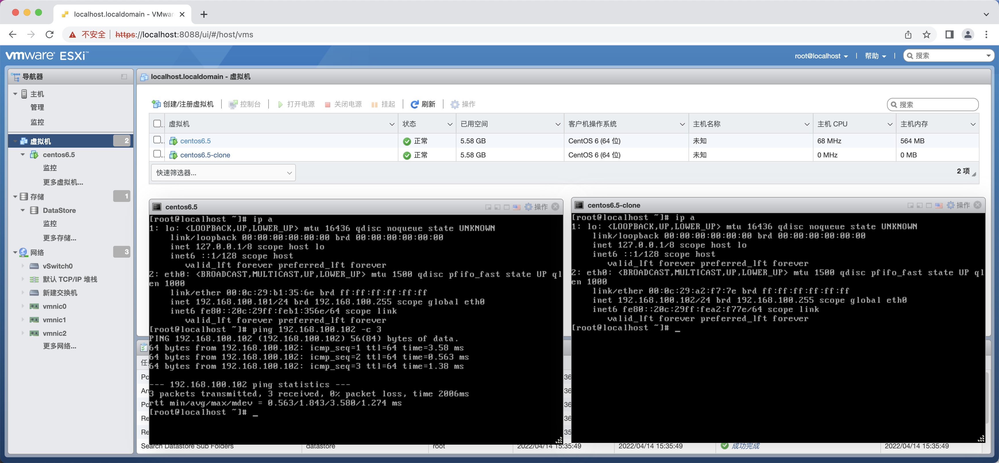

# Ex2

* 虚拟化实验

## QEMU-KVM虚拟机镜像制作

* virsh

```log
hsojo@ubuntu:~$ virsh list
 Id   Name          State
-----------------------------
 4    ubuntu20.04   running

hsojo@ubuntu:~$ 
```

* ssh

```log
hsojo@ubuntu:~$ ssh ubuntu@192.168.122.81
The authenticity of host '192.168.122.81 (192.168.122.81)' can't be established.
ECDSA key fingerprint is SHA256:dg/e7oHguZoeAOgRn5UEbpPNzqpJIRVI91FtfC/us70.
Are you sure you want to continue connecting (yes/no/[fingerprint])? yes
Warning: Permanently added '192.168.122.81' (ECDSA) to the list of known hosts.
ubuntu@192.168.122.81's password: 
Welcome to Ubuntu 20.04.3 LTS (GNU/Linux 5.11.0-27-generic x86_64)

 * Documentation:  https://help.ubuntu.com
 * Management:     https://landscape.canonical.com
 * Support:        https://ubuntu.com/advantage


Your Hardware Enablement Stack (HWE) is supported until April 2025.
Last login: Tue Apr 12 07:10:55 2022 from 192.168.122.1
ubuntu@ubuntu:~$ 
```

## 配置虚拟存储池

* 步骤
  * 添加两个硬盘，重启
  * “存储” - 新建数据存储，选中新添加硬盘1
  * 创建完成后，右键增加容量，选中并添加硬盘2


## VSwitch虚拟交换机，VLAN配置

* 步骤
  * 添加两个网卡，都连接到仅主机网络，重启
  * “网络” - “虚拟交换机” 添加标准虚拟交换机，并添加两个上行链路分别为创建的两个网卡
  * “网络” - “端口组” 添加两个端口组，分别设置**不同 VLAN ID**，选中添加的虚拟交换机


## 虚拟服务器配置，启动

* 步骤
  * 安装两个虚拟机，并连接到相同的任一端口组
  * 配置IP，并测试连通



## 虚拟服务器从真实交换机（或ENSP，EVE-NG中的交换机获得IP地址，并通信）

* 步骤
  * 配置交换机VLAN，及Trunk模式
  * Trunk端口桥接ESXI主机上联网卡
